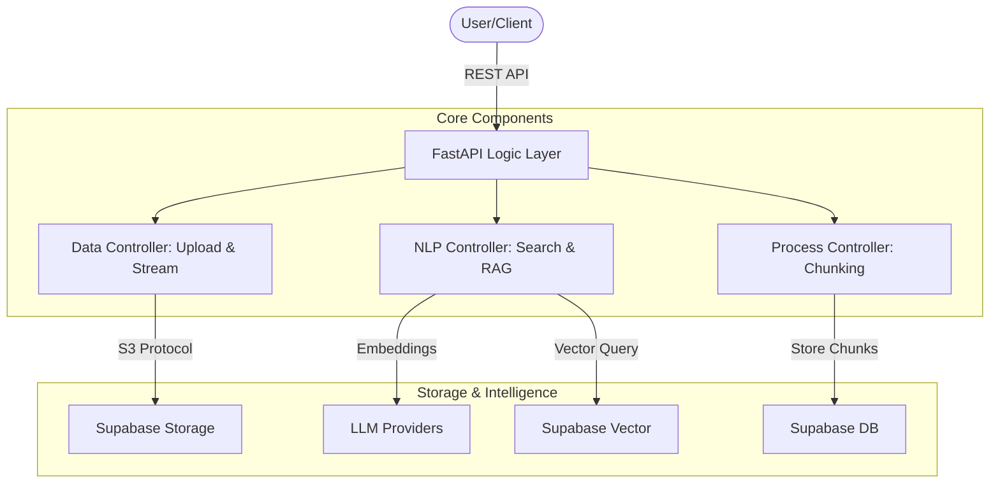

# 🚀 Mini-RAG: Minimal Retrieval-Augmented Generation

[](https://fastapi.tiangolo.com/)
[](https://www.python.org/)
[](https://supabase.com/)
[](https://opensource.org/licenses/MIT)

A streamlined, high-performance RAG (Retrieval-Augmented Generation) implementation built with **FastAPI** and **Supabase**. This project serves as a professional baseline or educational template for building modern AI-powered question-answering systems.

---

## 🌟 Key Features

* **⚡ High Performance**: Lightweight FastAPI backend optimized for asynchronous processing.
* **👁️ Integrated OCR**: Advanced Optical Character Recognition for PDFs using AI-powered extraction.
* **🧠 Multi-LLM Orchestration**: Native integration with **OpenAI**, **Cohere**, **MistralAI**, and **Google Gemini**.
* **📂 Intelligent Document Processing**: Automated splitting and chunking of `.pdf` and `.txt` files.
* **🔎 Semantic Vector Search**: Powered by **Supabase Vector (pgvector)** for high-precision retrieval.
* **🪣 Multi-Bucket Storage**: Dynamic management of Supabase Storage buckets with automatic overflow handling (50MB limits).
* **🌊 Memory-Efficient Streaming**: Streaming file uploads to handle heavy assets without OOM risks.
* **🎨 Multi-language Support**: Configurable prompt templates for **Arabic** and **English**.
* **🔐 Development SSL**: Built-in self-signed certificate generation for secure local HTTPS testing.

---

## 🛠️ Technology Stack

| Category | Technology |
| :--- | :--- |
| **Framework** |  |
| **Database** |   |
| **AI/LLM** |   |
| **Storage** |  |

---

## 🏗️ Architecture Overview

The system follows a clean, modular architecture designed for horizontal scalability:



---

## 🚀 Quick Start

### 1. Prerequisites

* Python 3.11+

* [Supabase Project](https://supabase.com/) (Free Tier works great!)

### 2. Installation

```bash
git clone https://github.com/AHMEDHANY146/MIni-RAG-APP-V1
conda create -n mini-rag python=3.11
conda activate mini-rag
pip install -r requirements.txt
```

### 3. Environment Setup

Create a `.env` file from the template:

```bash
cp .env.example .env
```

Update your credentials:

```env
SUPABASE_URL=your_project_url
SUPABASE_SERVICE_ROLE_KEY=your_service_key
OPENAI_API_KEY=your_openai_key
# Choose your providers
GENERATION_BACKEND=OPENAI
EMBEDDING_BACKEND=OPENAI
```

### 4. Run the API

```bash
uvicorn main:app --reload --host 0.0.0.0 --port 5000
```

---

## 📡 API Endpoints Summary

| Method | Endpoint | Description |
| :--- | :--- | :--- |
| `POST` | `/api/v1/data/upload/{project_id}` | Streaming file upload for processing. |
| `POST` | `/api/v1/data/process/{project_id}` | Chunk and index project files. |
| `POST` | `/api/v1/nlp/index/answer/{project_id}`| Query the RAG engine with natural language. |
| `GET` | `/api/v1/nlp/index/info/{project_id}` | Retrieve vector database health and info. |

---

## ❤️ Credits & Appreciation

This version is a refactored and production-ready evolution of the original project.
Special thanks to **[@bakrianoo](https://github.com/bakrianoo)** for the original inspiration and the incredible educational content that made this project possible.

## 📄 License

Licensed under the **MIT License**. See [LICENSE](LICENSE) for details.
